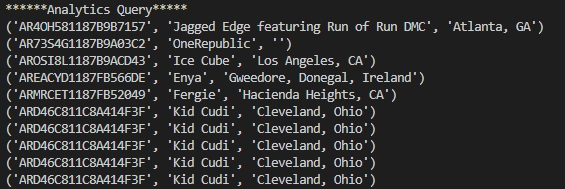

## Introduction

This directory contains the cloud data warehouse project which is the second project of the Udacity Nanodegree in Data Engineering with AWS.

The project demonstrates the understanding of using AWS services, such as S3, RedShift and EC2 to implement data warehouse infrastructure for the analytics use cases of a fictional music streaming startup.

## Schema Design

The `sql_queries.py` contains scripts that define and implement the data warehouse schema.

Seven (7) tables were implemented - 2 as the staging tables and 5 as the fact-schema tables. The staging tables; `staging_events_table` and `staging_songs_table`, schema reflect the structure of the data coming from the s3 buckets, and expected to be loaded into the staging tables in Redshift. 

Images provided in the project guide to depict the structure of these tables were used in deciding the data type, among others, while designing their respective schema. The exception is the `ts` column of the `staging_events_tables` which was counterintuitively a unix epoch time, but represented as `BINGINT`. This was the first debugging issue because the `ts` column was initially represented with `TIMESTAMP`.

Primary Key identity is given to the staging tables and the created facts and dimension tables, using the Redshift `INT IDENTITY(0,1) PRIMARY KEY` implementation. The identity column would be incrementally auto-populated. Respective data types are initially provided based on intuitive understanding of the data columns and the information about different types of data supported by Redshift. This led to another debugging issue: `String value more than the length in DDL`. It was a challenging process while trying to ensure resources are maximized by assigning the sufficient byte value, without over-assigning. At the end, `TEXT` was used instead of `VARCHAR` in many instances and the highest value of `VARCHAR` was the last option in few cases.

Though preliminary guide was provided for the fact-dimension relationship of the fact and dimension tables, there were further thoughts on the relationship between the tables to inform primary and foreign keys designation, even though Redshift does not enforce them. They would be used for query optimizer. The fact table has a relationship with the each of the dimension table. This would provide opportunity for aggregates and analysis. But, unfortaunately, Redshift does not even allow foreign key implementation.

The five dimension tables `user_table`, `song_table`, `artist_table` and `time_table` also have the implemented `INT IDENTITY(0,1) PRIMARY KEY` for their primary keys which are `user_table_id`, `song_table_id`, `artist_table_id` and `time_table_id`, respectively. The pre-existing but transformed identity columns from the staging tables, `song_id`, `artist_id`, `timestamp_id`, `session_id` and `user_id`, were firstly attached with `NOT NULL` attribute. 

However, error stating that `Cannot insert a NULL value into column` from the `INSERT` statements showed that some of these supposed identity columns in the staging columns are of `NULL` values. Debugging was iteratively done to remove `NOT NULL` attribute from `user_id`, `session_id`. 

An example of this error is depicted by the image below:

These table relationships are used in the ETL SQL queries provided to transform the loaded data from the staging tables to the fact and dimension tables.

## Scripts

The create scripts which include the `CREATE` and `DROP` queries, and the `INSERT` scripts, which include the `COPY` statement and the SQL to SQL ELT queries are all in the `sql_queries.py` file. 

A section on analytics, aimed at providing descriptive information about the users, and artists, and to validate the prior phases, is also provided. The images attached below are the respective responses from the analytics queries additionally provided.

## How to run 

First, run `create_tables.py` script to take care of creation of the tables.

Second, run `etl.py` script for the ETL, and the added analytics queries. The response of the analytics queries are printed to the command terminal.
